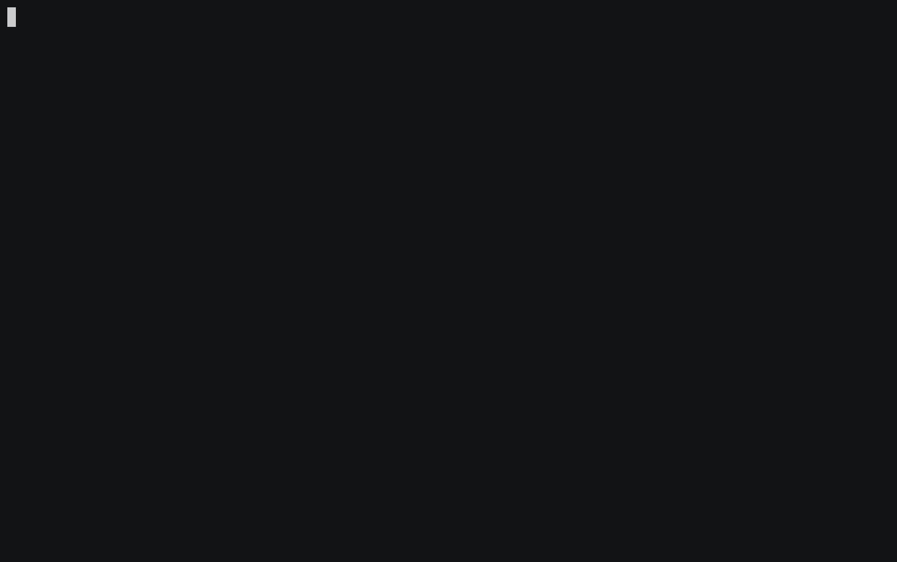
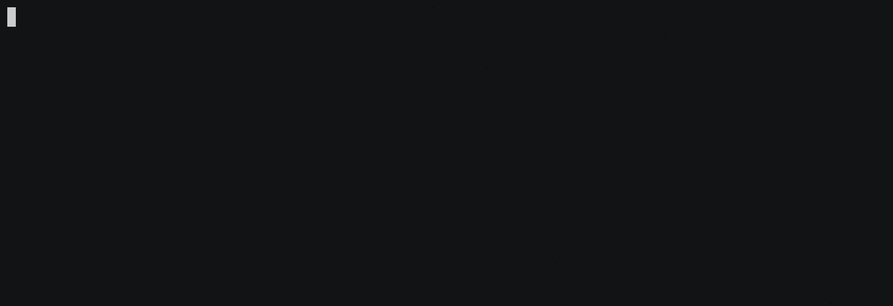

# Laravel 6.0 Test-Driven Development: Project Setup

## Pre-Setup
1.  Instal Laravel:
    ```sh
    $ composer create-project --prefer-dist laravel/laravel:^6.0 laravel60-tdd
    ```
    Lanjutkan dengan masuk ke direktori _project_:
    ```sh
    $ cd laravel60-tdd
    ```
2.  Instal Laravel Browser Kit Testing:
    ```sh
    $ composer require --dev laravel/browser-kit-testing
    ```
3.  Instal Laravel UI:
    ```sh
    $ composer require --dev laravel/ui
    ```
4.  Buat _Authentication Scaffolding_ untuk Laravel:
    ```sh
    $ php artisan ui bootstrap --auth
    ```
5.  **Catatan:** Disini kita bisa pilih, ingin _build_ sendiri dependensi CSS dan JavaScript untuk Bootstrap, atau pakai yang sudah jadi:
    *   Jika ingin _build_ sendiri:
        1.  Instal dependensi Laravel Mix: `npm install`.
        2.  Jalankan `npm run dev`.
    *   Jika ingin pakai yang sudah jadi:
        1.  Silakan unduh `public/css/app.css` dan `public/js/app.js` dari repo saya.
        2.  Letakkan masing-masing berkas ke `public/css` dan `public/js` di dalam direktori proyek.

## Setup: Browser Kit Testing
1.  Buka `tests/TestCase.php`, dan sesuaikan isinya supaya menggunakan _test case_ dari Browser Kit Testing:
    ```php
    <?php

    namespace Tests;

    use Laravel\BrowserKitTesting\TestCase as BaseTestCase;

    abstract class TestCase extends BaseTestCase
    {
        use CreatesApplication;

        public $baseUrl = 'http://localhost';
    }
    ```
2.  Jalankan pengujian:
    ```sh
    ./vendor/bin/phpunit
    ```
    **Catatan:** Untuk setiap langkah "Jalankan pengujian" selanjutnya, langsung jalankan perintah seperti di atas.
    **Catatan Kedua:** Untuk seluruh contoh eksekusi perintah pengujian ke depan, saya menggunakan alias `phpunit` untuk mempersingkat pemanggilan perintahnyanya. Bagi yang ingin pakai menggunakan yang sama di Linux atau macOS (atau WSL atau Git Bash for Windows), silakan gunakan perintah berikut sebelum mulai mengerjakan:
    ```sh
    $ alias phpunit="./vendor/bin/phpunit"
    ```
    Atau teman-teman juga bisa menambahkan perintah diatas ke dalam berkas `.bashrc` atau `.zshrc` supaya tidak repot.
3.  Kita akan dapat _fail_ di `test/Feature/ExampleTest.php`:
    
    _Fail_ ini terjadi karena disitu kita masih menggunakan _assertion_ bawaan Laravel, belum menggunakan _assertion_ dari Browser Kit Testing. Kita perlu sesuaikan isi berkasnya:
    ```php
    <?php
    // tests/Feature/ExampleTest.php

    public function testBasicTest()
    {
        // Komen 2 baris dari berkas asli
        // $response = $this->get('/');

        // $response->assertStatus(200);
        
        // Lalu gantikan dengan ini
        $this->visit('/');
    }
    ```
    **Perhatikan** bahwa kita melakukan komen terhadap baris yang sudah ada, _**bukan**_ menghapus barisnya secara langsung. Ini untuk memastikan modifikasi yang kita lakukan bersifat sementara; kita masih perlu menjalankan test lagi untuk melihat apakah modifikasi yang ktia lakukan sudah benar.
4.  Jalankan pengujian. Kali ini (harusnya) sudah _passed_:
    
5.  Jika sudah _passed_, kita bisa bersihkan komen dari isi _test case_:
    ```php
    <?php
    // tests/Feature/ExampleTest.php

    public function testBasicTest()
    {
        $this->visit('/');
    }
    ```

## Setup: PHPUnit
Umumnya, SQLite digunakan sebagai _database system_ dalam testing, karena SQLite memiliki fitur _in-memory database_, sehingga kita tidak perlu repot-repot membuat _database_ terpisah untuk keperluan pengujian. Selain itu, dengan menggunakan _in-memory database_, proses pengujian akan berjalan lebih cepat.
1.  Buka `phpunit.xml`, tambahkan 2 baris berikut ke dalam elemen `<php>`:
    ```xml
    <server name="DB_CONNECTION" value="sqlite"/>
    <server name="DB_DATABASE" value=":memory:"/>
    ```
2.  Jalankan test. Harusnya sudah bisa _passed_:
    