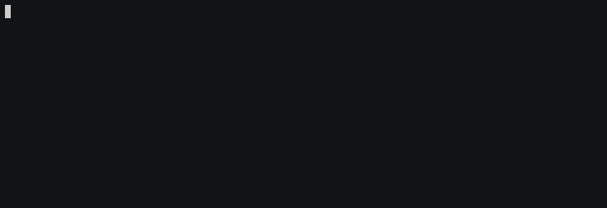

# Laravel 6.0 Test-Driven Development: Case Study and First Failing Test

## Studi Kasus
CRUD Task Management.

#### Spesifikasi Fitur
- Tabel `tasks` dengan `atribut name`, `description`, `is_done`.
- Atribut `is_done`: `false` artinya belum dikerjakan, `true` artinya sudah.
- User dapat melihat daftar _task_.
- User dapat menambah _task_ baru.
- User dapat mengubah _task_.
- User dapat menghapus _task_.

#### Prioritas Sub-Fitur dan Rencana Konsep Operasi
1. **Create task**: User dapat menambah _task_ baru dengan membuka halaman "All Tasks", mengisi kolom `name` dan `description` pada form, lalu klik "Create Task". Setelah berhasil, _task_ akan tersimpan ke _database_, lalu user akan di-_redirect_ ke halaman "All Tasks" dan dapat melihat _task_ yang baru saja ditambahkan.
2. **Read task**: Jika ada task dalam _database_, lalu user membuka halaman "All Tasks", maka user dapat melihat daftar _task_ yang ada, lengkap dengan `name` dan `description`.
3. **Update task**: Jika ada task dalam _database_, lalu user membuka halaman "All Tasks", maka user dapat melihat tombol "Edit Task". User dapat mengubah salah satu _task_ yang ada dengan mengklik tombol "Edit Task" dari _task_ bersangkutan, mengubah `name` dan `description`, dan menyimpan perubahan data dengan mengklik tombol "Update Task". Setelah berhasil, perubahan _task_ akan tersimpan ke _database_, lalu user akan di-_redirect_ ke halaman "All Tasks" dan dapat melihat _task_ yang baru saja diubah.
4. **Delete task**: Jika ada task dalam _database_, lalu user membuka halaman "All Tasks", maka user dapat melihat tombol "Delete Task". User dapat menghapus salah satu _task_ yang ada dengan mengklik tombol "Delete Task" dari _task_ bersangkutan. Setelah berhasil, _task_ akan dihapus dari _database_, lalu user akan di-_redirect_ ke halaman "All Tasks" dan dapat melihat bahwa _task_ yang dihapus sudah tidak tampil atau hilang.

Jika diperhatikan, urutan prioritas sesuai dengan _keyword_ **CRUD**: _create_, _read_, _update_, lalu _delete_.

## Persiapan
Biasakan untuk menjakankan pengujian terlebih dulu sebelum mengerjakan sesuatu dalam _project_, untuk memastikan pengujian yang sudah dibuat berjalan dengan baik, dengan _output_ dari pengujian sama persis dengan ketika terakhir kali kita melakukan pengujian.



## Membuat Test Case dan Test Method
1.  Buat _test case_ baru:
    ```sh
    $ php artisan make:test ManageTaskTest
    ```
    Perintah diatas akan membuat _test case_ di `tests/Feature/ManageTasksTest.php`. Sesuaikan isinya menjadi seperti ini:
    ```php
    <?php

    namespace Tests\Feature;

    use Tests\TestCase;
    use Illuminate\Foundation\Testing\WithFaker;
    use Illuminate\Foundation\Testing\RefreshDatabase;

    class ManageTaskTest extends TestCase
    {
        /**
        * A basic feature test example.
        *
        * @return void
        */
        public function testExample()
        {
            $this->assertTrue(true);
        }
    }
    ```
2.  Jalankan pengujian untuk memastikan ada _assertion_ baru ditambahkan ke dalam _test suite_:
    
3.  Lanjut dengan membuat _test method_ untuk _test case_-nya. _Test method_ yang dibuat harus sesuai dengan Sub-Fitur dalam Rencana Konsep Operasi diatas, dengan masing-masing _task method_ mewakili satu sub-fitur:
    ```php
    <?php
    // tests/Feature/ManageTasksTest.php

    class ManageTaskTest extends TestCase
    {
        /** @test */
        public function test_users_can_create_a_task()
        {
            $this->assertTrue(true);
        }

        /** @test */
        public function test_users_can_read_all_tasks()
        {
            $this->assertTrue(true);
        }

        /** @test */
        public function test_users_can_edit_an_existing_task()
        {
            $this->assertTrue(true);
        }

        /** @test */
        public function test_users_can_delete_an_existing_task()
        {
            $this->assertTrue(true);
        }
    }
    ```
4.  Jalankan pengujian untuk memastikan ada _assertion_ baru ditambahkan ke dalam _test suite_:
    

## Failing Test Pertama
_Failing test_ adalah _test script_ untuk menguji fitur yang belum ada dalam sistem, jadi pasti akan gagal atau _fail_ ketika pengujian dijalankan. Kita akan fokus _test method_ `test_users_can_create_a_task()`.
1.  Untuk mempermudah visualisasi langkah pengujian, kita bisa buat komentar yang berisi tahapan pengujian seperti ini:
    ```php
    <?php
    // tests/Feature/ManageTasksTest.php

    class ManageTaskTest extends TestCase
    {
        /** @test */
        public function test_users_can_create_a_task()
        {
            // User membuka halaman "All Tasks"

            // User mengisi kolom `name` dan `description`, lalu klik "Create Task"

            // Pastikan task berhasil tersimpan di database

            // Redirect ke halaman "All Tasks"

            // User dapat melihat task yang baru saja ditambahkan
        }
    }
    ```
2.  Dari komentar seperti diatas, lanjutkan dengan mengisi tahapan pengujiannya:
    ```php
    <?php
    // tests/Feature/ManageTasksTest.php

    class ManageTaskTest extends TestCase
    {
        /** @test */
        public function test_users_can_create_a_task()
        {
            // User membuka halaman "All Tasks"
            $this->visit('/tasks');

            // User mengisi kolom `name` dan `description`, lalu klik "Create Task"
            $this->submitForm('Create Task', [
                'name' => 'My First Task',
                'description' => 'This is my first task in my new job.',
            ]);

            // Pastikan task berhasil tersimpan di database
            $this->seeInDatabase('tasks', [
                'name' => 'My First Task',
                'description' => 'This is my first task in my new job.',
                'is_done' => false,
            ]);

            // Redirect ke halaman "All Tasks"
            $this->seePageIs('/tasks');

            // User dapat melihat task yang baru saja ditambahkan
            $this->see('My First Task');
            $this->see('This is my first task in my new job.');
        }
    }
    ```
3.  Jalankan pengujian. Pastikan pengujiannya _fail_ 😂:
    
4.  Verifikasi _error_ yang dihasilkan oleh test dengan mengaktifkan _development server_ milik Laravel:
    ```sh
    php artisan serve
    ```
    Lalu akses http://localhost:8000/tasks dari _browser_. Bisa dipastikan `404 Not Found`.