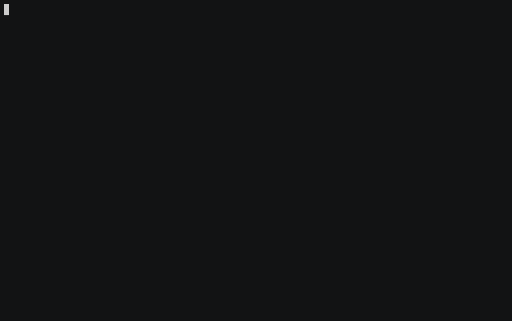
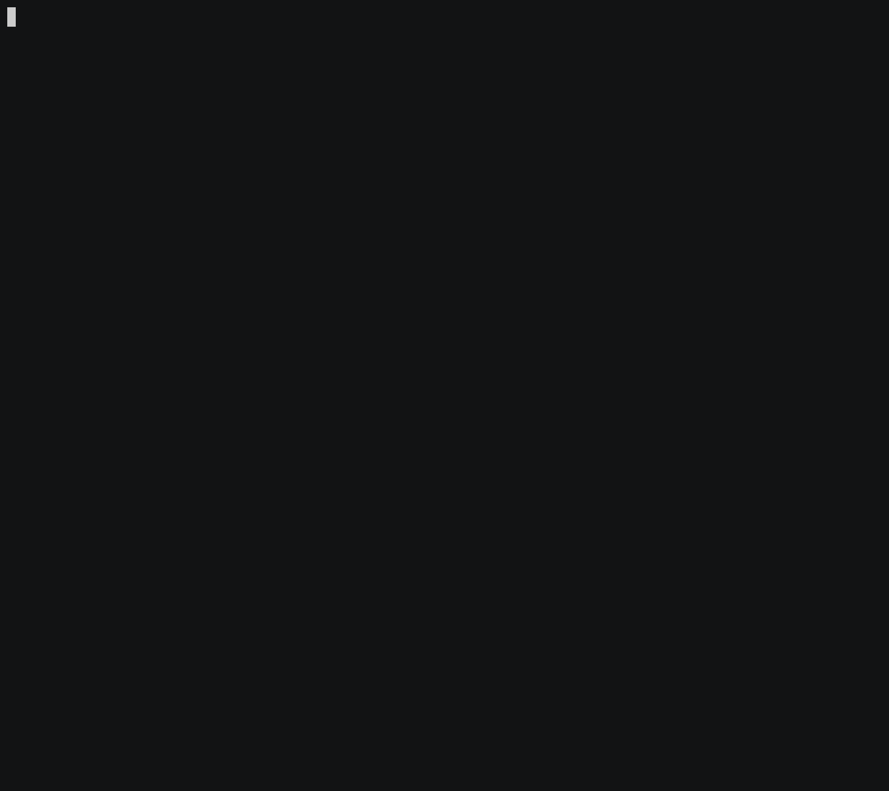
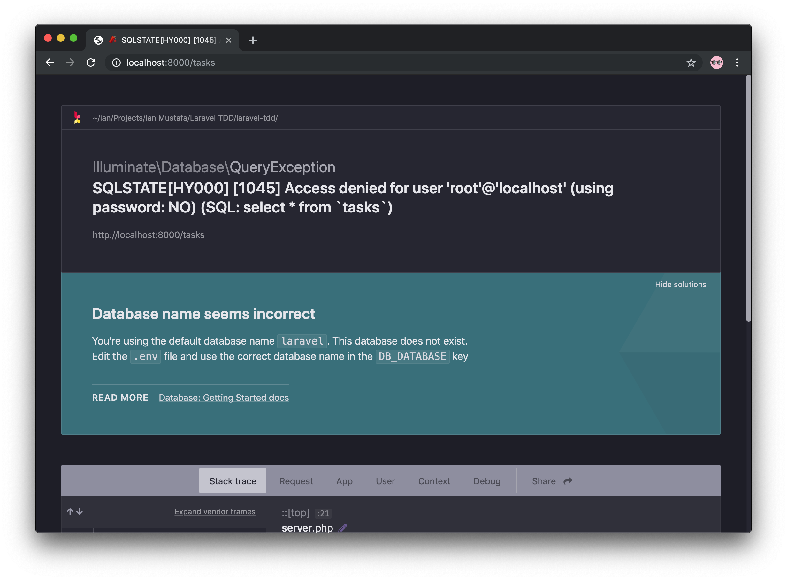
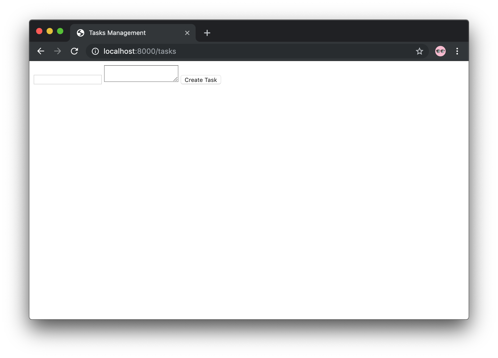
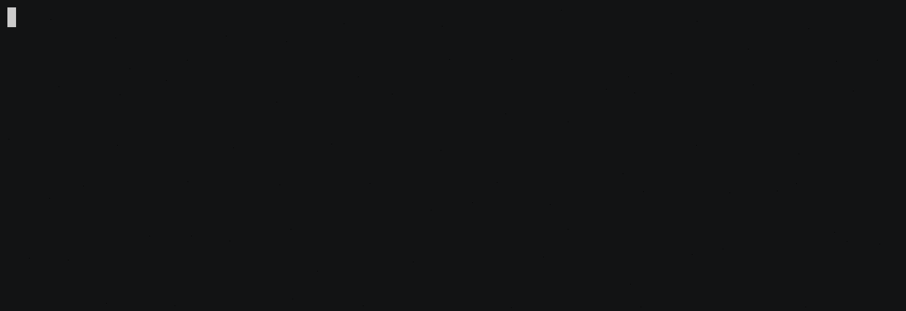
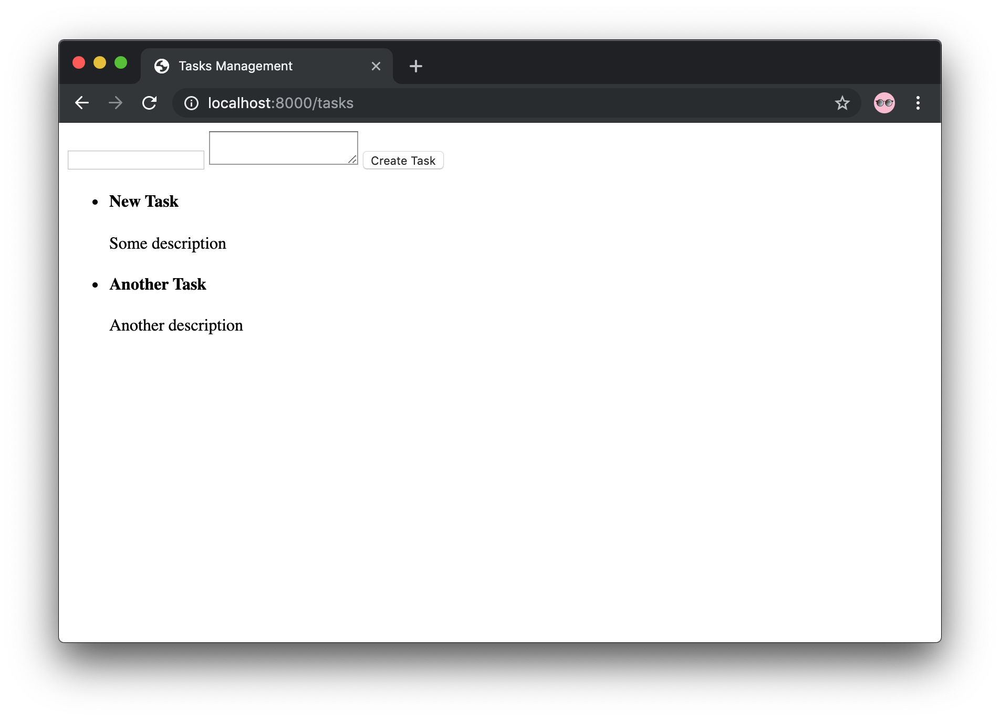
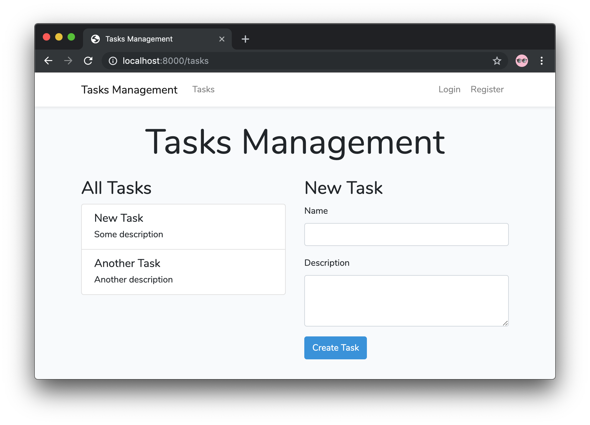

# Laravel 6.0 Test-Driven Development: First Passed Test

## Penerapan Test-Driven Development
### Tahapan
1. Buat kode pengujian.
2. Jalankan pengujian dan dapatkan _fail_.
3. Tulis kode.
4. Jalankan pengujian. Jika dapat _fail_, perbaiki kode dan jalankan ulang pengujian. Ulangi hingga _passed_.
5. Refaktor kode.

### Eksekusi
Dalam melakukan eksekusi tahapan diatas, kita akan melakukan 4 hal berikut secara berulang-ulang hingga mendapatkan _passed test_:
1. Jalankan pengujian.
2. Failed, dapat `error`.
3. Temukan `penyebab`.
4. Tentukan `solusi`.

## Mari Kita Mulai
### #1
#### Jalankan pengujian


#### Hasil: Failed
```
A request to [http://localhost/tasks] failed. Received status code [404].
```

#### Penyebab
Belum ada _route_ untuk `/tasks`.

#### Solusi
Buat _route_ untuk `/tasks` dengan _action_ mengarah ke `TasksController@index`:
```php
<?php
// routes/web.php

Route::get('/', function () {
    return view('welcome');
});

Auth::routes();

Route::get('/home', 'HomeController@index')->name('home');

Route::get('tasks', 'TasksController@index')->name('tasks.index'); // Tambahkan baris ini
```

### #2
#### Jalankan pengujian


#### Hasil: Failed
```
A request to [http://localhost/tasks] failed. Received status code [500].

Caused by
ReflectionException: Class App\Http\Controllers\TasksController does not exist.
```

#### Penyebab
Belum ada _controller_ `TasksController`.

#### Solusi
Buat _controller_ `TasksController`:
```sh
$ php artisan make:controller TasksController
```

### #3
#### Jalankan pengujian


#### Hasil: Failed
```
A request to [http://localhost/tasks] failed. Received status code [500].

Caused by
BadMethodCallException: Method App\Http\Controllers\TasksController::index does not exist.
```

#### Penyebab
Belum ada _method_ `index` di `TasksController`.

#### Solusi
Buat _method_ `index` di `TasksController`:
```php
<?php
// app/Http/Controllers/TasksController.php

class TasksController extends Controller
{
    public function index()
    {
        //
    }
}
```

### #4
#### Jalankan pengujian


#### Hasil: Failed
```
A request to [http://localhost/tasks] failed. Received status code [500].

Casued by
InvalidArgumentException: Could not find a form that has submit button [Create Task].
```

#### Penyebab
Tidak ada tombol _submit_ "Create Task", karena belum ada `return view()`, jadi _route_-nya menghasilkan halaman kosong.

#### Solusi
Buat `return view()` untuk _method_ `index()`:
```php
<?php
// app/Http/Controllers/TasksController.php

class TasksController extends Controller
{
    public function index()
    {
        return view('tasks.index'); // Tambahkan baris ini
    }
}
```

### #5
#### Jalankan pengujian


#### Hasil: Failed
```
A request to [http://localhost/tasks] failed. Received status code [500].

Caused by
InvalidArgumentException: View [tasks.index] not found.
```

#### Penyebab
Belum ada _view_ `tasks.index`.

#### Solusi
Buat _view_ `tasks.index` di `resources/views/tasks/index.blade.php`:
```html
<!doctype html>
<html lang="en">
<head>
    <meta charset="utf-8">
    <meta name="viewport" content="width=device-width, initial-scale=1.0, shrink-to-fit=no">
    <title>Tasks Management</title>
</head>
<body>

</body>
</html>
```

### #6
#### Jalankan pengujian


#### Hasil: Failed
```
A request to [http://localhost/tasks] failed. Received status code [500].

Casued by
InvalidArgumentException: Could not find a form that has submit button [Create Task].
```

#### Penyebab
Tidak ada tombol _submit_ "Create Task" dalam _view_ `tasks.index`, karena _view_-nya masih kosong.

#### Solusi
Buat elemen `form` dengan tombol submit "Create Task" dalam _view_ `tasks.index`:
```html
<!doctype html>
<html lang="en">
<head>
    <meta charset="utf-8">
    <meta name="viewport" content="width=device-width, initial-scale=1.0, shrink-to-fit=no">
    <title>Tasks Management</title>
</head>
<body>
    <form action="{{ url('tasks') }}" method="POST">
        <button type="submit">Create Task</button>
    </form>
</body>
</html>
```

### #7
#### Jalankan pengujian


#### Hasil: Failed
```
InvalidArgumentException: Unreachable field "name".
```

#### Penyebab
Belum ada `input` dengan nama `name` dalam `form` di `tasks.index`.

#### Solusi
Buat `input` dengan nama `name` dan tipe `text`:
```html
<!doctype html>
<html lang="en">
<head>
    <meta charset="utf-8">
    <meta name="viewport" content="width=device-width, initial-scale=1.0, shrink-to-fit=no">
    <title>Tasks Management</title>
</head>
<body>
    <form action="{{ route('tasks.store') }}" method="POST">
        <input type="text" name="name"> <!-- Tambahkan baris ini -->
        <button type="submit">Create Task</button>
    </form>
</body>
</html>
```

### #8
#### Jalankan pengujian


#### Hasil: Failed
```
InvalidArgumentException: Unreachable field "description".
```

#### Penyebab
Belum ada `input` dengan nama `description` dalam `form` di `tasks.index`.

#### Solusi
Karena ini untuk _description_, kita buat `input`-nya berupa `textarea` dengan nama `description`:
```html
<!doctype html>
<html lang="en">
<head>
    <meta charset="utf-8">
    <meta name="viewport" content="width=device-width, initial-scale=1.0, shrink-to-fit=no">
    <title>Tasks Management</title>
</head>
<body>
    <form action="{{ route('tasks.store') }}" method="POST">
        <input type="text" name="name">
        <textarea name="description"></textarea> <!-- Tambahkan baris ini -->
        <button type="submit">Create Task</button>
    </form>
</body>
</html>
```

### #9
#### Jalankan pengujian


#### Hasil: Failed
```
A request to [http://localhost/tasks] failed. Received status code [405].

Caused by
Symfony\Component\HttpKernel\Exception\MethodNotAllowedHttpException: The POST method is not supported for this route. Supported methods: GET, HEAD.
```

#### Penyebab
Di dalam _route_, sudah ada _route_ `tasks` yang sudah kita buat tadi, tapi menggunakan HTTP _method_ `GET`. Sedangkan untuk _form submit_, _HTTP method_ yang digunakan adalah `POST`, dan _route_ bersangkutan belum dibuat.

#### Solusi
Buat _route_ `POST` untuk `tasks` dengan _action_ mengarah ke `TasksController@store`:
```php
<?php

Route::get('/', function () {
    return view('welcome');
});

Auth::routes();

Route::get('/home', 'HomeController@index')->name('home');

Route::get('tasks', 'TasksController@index')->name('tasks.index');
Route::post('tasks', 'TasksController@store')->name('tasks.store'); // Tambahkan baris ini
```

### #10
#### Jalankan pengujian


#### Hasil: Failed
```
A request to [http://localhost/tasks] failed. Received status code [500].

Caused by
BadMethodCallException: Method App\Http\Controllers\TasksController::store does not exist.
```

#### Penyebab
Belum ada _method_ `store` di `TasksController`.

#### Solusi
Buat _method_ `store` di `TasksController`:
```php
<?php
// app/Http/Controllers/TasksController.php

class TasksController extends Controller
{
    public function index()
    {
        return view('tasks.index');
    }

    public function store()
    {
        //
    }
}
```

### #11
#### Jalankan pengujian


#### Hasil: Failed
```
Illuminate\Database\QueryException: SQLSTATE[HY000]: General error: 1 no such table: tasks.
```

#### Penyebab
Belum ada tabel `tasks` di _database_.

#### Solusi
Buat tabel `tasks` di _database_. Kita akan menggunakan _migration_ untuk membuat tabelnya. Nah, karena _migration_-nya dan _model_ `Task`-nya sama-sama belum ada dan baru akan dibuat, kita buat _model_ `Task` sekaligus _migration_-nya dengan satu perintah:
```bash
$ php artisan make:model -m Task
```
Tambahan flag `-m` pada perintah `make:model` menandakan bahwa kita ingin sekaligus membuat _migration_ ketika membuat _model_.

### #12
#### Jalankan pengujian


#### Hasil: Failed
```
Illuminate\Database\QueryException: SQLSTATE[HY000]: General error: 1 no such table: tasks.
```

#### Penyebab
Belum ada tabel `tasks` di _database_. **Kok sama?**

Yap, karena _test case_ belum tahu _migration_ yang barusan dibuat harus diapakan.

#### Solusi
Kita bisa manfaatkan _trait_ `RefreshDatabase` pada _test case_ `ManageTaskTest`, supaya setiap kali kita menjalankan pengujian, _test case_ akan otomatis me-_refresh_ _migration_ pada database. Mirip dengan menjalankan perintah `php artisan migrate:refresh`:
```php
<?php
// tests/Feature/ManageTaskTest.php

use Illuminate\Foundation\Testing\RefreshDatabase; // Pastikan trait-nya sudah di-import

class ManageTaskTest extends TestCase
{
    use RefreshDatabase; // Tambahkan trait-nya disini

    /** @test */
    public function test_users_can_create_a_task()
    {
        // ...
    }
}
```

### #13
#### Jalankan pengujian


#### Hasil: Failed
```
Unable to find row in database table [tasks] that matched attributes [{"name":"My First Task","description":"This is my first task in my new job.","is_done":false}].
```

#### Penyebab
_Test case_ tidak dapat menemukan data dalam _database_, karena belum ada _action_ yang bertugas untuk menyimpan data dari _form_ ke _database_ dalam _method_ `store` di `TasksController`.

#### Solusi
Buat _action_ untuk menyimpan data dari _form_ ke _database_ dalam _method_ `store` di `TasksController`:
```php
<?php
// app/Http/Controllers/TasksController.php

use App\Task; // Pastikan model-nya sudah di-import
use Illuminate\Http\Request;

class TasksController extends Controller
{
    public function store(Request $request)
    {
        Task::create($request->only('name', 'description'));
    }
}
```

### #14
#### Jalankan pengujian


#### Hasil: Failed
```
A request to [http://localhost/tasks] failed. Received status code [500].

Caused by
Illuminate\Database\Eloquent\MassAssignmentException: Add [name] to fillable property to allow mass assignment on [App\Task].
```

#### Penyebab
Kolom `name` belum di-set sebagai kolom _fillable_ dalam _model_ `Task`.

#### Solusi
Tambahkan _protected property_ `$fillable` dengan tipe data `array` ke _model_ `Task`, dan isi dengan kolom `name` dan `description`:
```php
<?php
// app/Task.php

class Task extends Model
{
    protected $fillable = ['name', 'description'];
}
```

### #15
#### Jalankan pengujian


#### Hasil: Failed
```
A request to [http://localhost/tasks] failed. Received status code [500].

Caused by
PDOException: SQLSTATE[HY000]: General error: 1 table tasks has no column named name.
```

#### Penyebab
Tidak ada kolom dengan nama `name` di tabel `tasks`.

#### Solusi
Buat semua kolom yang dibutuhkan oleh tabel melalui _migration_. Buka file `database/migrations/xxxxxx_create_tasks_table.php` dan tambahkan kolom `name` dengan tipe data `string`, `description` dengan tipe data `string` dan `is_done` dengan tipe data `boolean`:
```php
<?php
// database/migrations/xxxxxx_create_tasks_table.php

class CreateTasksTable extends Migration
{
    public function up()
    {
        Schema::create('tasks', function (Blueprint $table) {
            $table->bigIncrements('id');
            $table->string('name'); // Tambahkan kolom ini,
            $table->string('description'); // ini,
            $table->boolean('is_done'); // dan ini
            $table->timestamps();
        });
    }
}
```

### #16
#### Jalankan pengujian


#### Hasil: Failed
```
A request to [http://localhost/tasks] failed. Received status code [500].

Caused by
PDOException: SQLSTATE[23000]: Integrity constraint violation: 19 NOT NULL constraint failed: tasks.is_done.
```

#### Penyebab
Kolom `is_done` di _database_ tidak memiliki _default value_, sehingga tidak dapat dikosongkan ketika proses _insert_ ke _database_.

#### Solusi
Tambahkan _default value_ dengan nilai `false` untuk kolom `is_done` ke _migration_ `xxxxxx_create_tasks_table.php`:
```php
<?php
// database/migrations/xxxxxx_create_tasks_table.php

class CreateTasksTable extends Migration
{
    public function up()
    {
        Schema::create('tasks', function (Blueprint $table) {
            $table->bigIncrements('id');
            $table->string('name');
            $table->string('description');
            $table->boolean('is_done')->default(false); // Tambahkan ini
            $table->timestamps();
        });
    }
}
```

### #17
#### Jalankan pengujian


#### Hasil: Failed
```
InvalidArgumentException: The current node list is empty.
```

#### Penyebab
_Error_ ini menunjukkan bahwa halaman tidak berisi apa-apa alias kosong setelah _form submit_ terjadi, karena memang belum ada _return_ di _method_ `store` di `TasksController`.

#### Solusi
Buat `return back()` di _method_ `store` di `TasksController` untuk kembali ke halaman sebelumnya setelah _form submit_:
```php
<?php
// app/Http/Controllers/TasksController.php

use App\Task;
use Illuminate\Http\Request;

class TasksController extends Controller
{
    public function store(Request $request)
    {
        Task::create($request->only('name', 'description'));

        return back(); // Tambahkan baris ini
    }
}
```

### #18
#### Jalankan pengujian


#### Hasil: Failed
```
Failed asserting that the page contains the HTML [My First Task]. Please check the content above.
```

#### Penyebab
Hasil _form submit_ tidak ditemukan di _route_ `/tasks` setelah _redirect_, karena memang belum ditampilkan.

#### Solusi
1.  Ambil _tasks list_ dari _database_, dan oper ke _view_ `tasks.index` agar dapat ditampilkan:
    ```php
    <?php
    // app/Http/Controllers/TasksController.php

    use App\Task;

    class TasksController extends Controller
    {
        public function index()
        {
            $tasks = Task::all(); // Tambahkan baris

            return view('tasks.index', compact(tasks)); // Tambahkan ini
        }
    }
    ```
2.  Tampilkan _tasks list_ ke _view_ `tasks.index`:
    ```html
    <!-- body -->
        <form action="{{ route('tasks.store') }}" method="POST">
            <input type="text" name="name">
            <textarea name="description"></textarea>
            <button type="submit">Create Task</button>
        </form>
        <ul>
            @foreach ($tasks as $task)
                <li>
                    <h4>{{ $task->name }}</h4>
                    <p>{{ $task->description }}</p>
                </li>
            @endforeach
        </ul>
    <!-- /body -->
    ```

### #19
#### Jalankan pengujian


#### Hasil: Passed! 🤩
**Yay, akhirnya kita berhasil _passed_! 🥳**
Dengan begini, _method_ `test_users_can_create_a_task()` di _test case_ `ManageTaskTest` sudah selesai dikerjakan.

## Mencoba Hasil Fitur dari _Browser_
Kita sudah tahu bahwa fitur yang dikerjakan sudah pasti berjalan. Namun kita sama sekali belum melihat hasil pengerjaan fiturnya melalui _browser_. Mari kita cari tahu dengan mengaktifkan _development server_ milik Laravel:
```
$ php artisan serve`
```
Lalu akses http://localhost:8000/tasks melalui _browser_.


**Wah, kok error?** Betul, karena sejak awal kita belum melakukan konfigurasi database di sisi aplikasi, hanya di sisi _test suite_ saja. Untuk itu, mari kita buat _database_-nya terlebih dahulu. Teman-teman bisa bebas memilih, mau pake PostgreSQL, MySQL atau MariaDB, tapi disini saya akan pakai SQLite saja, supaya lebih cepat prosesnya:
1.  Matikan _development server_ dengan menekan `Ctrl` + `C` di jendela terminal tempat _development server_ aktif.
2.  Buat file _database_ baru untuk SQLite:
    ```sh
    $ touch database/database.sqlite
    ```
3.  Konfigurasikan `.env` supaya menggunakan SQLite:
    ```env
    DB_CONNECTION=sqlite
    DB_DATABASE="/absolute/path/to/laravel-tdd/database/database.sqlite"
    ```
4.  Migrasikan tabel ke _database_:
    ```sh
    $ php artisan migrate
    ```
5. Aktifkan ulang _development server_ milik Laravel:
    ```
    $ php artisan serve
    ```
5.  Akses ulang http://localhost:8000/tasks melalui _browser_.


**Kok jelek ya... 😅** Tidak masalah, kita coba _input_ _task_ dulu secara langsung dari sini.


**Wah, kok gabisa? Kok _page expired_?** Iya, karena memang di dalam _form_ belum ada _hidden input_ untuk CSRF token, sehingga menyebabkan `419 Page Expired`. Untuk memperbaikinya, mari kita tambahkan `@csrf` persis di bawah deklarasi `form`:
```html
<!-- body -->
    <form action="{{ route('tasks.store') }}" method="POST">
        @csrf <!-- Tambahkan baris ini -->
        <input type="text" name="name">
        <textarea name="description"></textarea>
        <button type="submit">Create Task</button>
    </form>
    <ul>
        @foreach ($tasks as $task)
            <li>
                <h4>{{ $task->name }}</h4>
                <p>{{ $task->description }}</p>
            </li>
        @endforeach
    </ul>
<!-- /body -->
```
Berhubung kita telah melakukan perubahan kode, pastikan perubahannya tidak menyebabkan pengujian kembali _fail_.

### #20
#### Jalankan pengujian


#### Hasil: Passed! 🤩
Mantap. Artinya perubahan yang kita lakukan tidak menyebabkan kerusakan pada sistem. Kita bisa coba _input_ ulang _task_ via _browser_.


**Yay bisa 🥳** Sub-fitur pertama sudah selesai, selanjutnya mari kita perbaiki tampilannya supaya tidak sakit di mata. 😂

## Memperbaiki Tampilan
Karena sebelumnya kita sudah menjalankan `php artisan ui`, artinya kita sudah punya _scaffolding_ untuk _view_, lengkap dengan _layout view_ `layouts.app` yang berada di `resources/views/layouts.app.blade.php`. dengan adanya layout view, kita bisa langsung meng-_extend_ `layouts.app` untuk memanfaatkan _layout view_-nya. Mari kita sesuaikan `tasks.index` menjadi seperti ini:
```html
<!-- resources/views/tasks/index.blade.php -->
@extends('layouts.app')

@section('content')
<h1 class="text-center display-4 mb-4">Tasks Management</h1>
<div class="row justify-content-center">
    <div class="col-md-6 col-lg-5 mb-5 mb-md-0">
        <h2>All Tasks</h2>
        <ul class="list-group">
            @forelse ($tasks as $task)
            <li class="list-group-item">
                <h5 class="mb-1">{{ $task->name }}</h5>
                <p class="mb-0">{{ $task->description }}</p>
            </li>
            @empty
            <li class="list-group-item">
                <p class="mb-0">There are no tasks found. For now.</p>
            </li>
            @endforelse
        </ul>
    </div>

    <div class="col-md-6 col-lg-5">
        <h2>New Task</h2>
        <form action="{{ url('tasks') }}" method="POST">
            @csrf
            <div class="form-group">
                <label for="name">Name</label>
                <input type="text" name="name" id="name" class="form-control" autocomplete="off">
            </div>
            <div class="form-group">
                <label for="description">Description</label>
                <textarea class="form-control" name="description" id="description" rows="3"></textarea>
            </div>
            <button type="submit" class="btn btn-primary">Create Task</button>
        </form>
    </div>
</div>
@endsection
```
Lanjutkan dengan menyesuaikan `layouts.app` dengan mengubah beberapa bagian, yaotu judul halaman dan menambahkan link ke _route_ `/tasks`:
```html
<!-- resources/views/layouts/app.blade.php -->
<!-- Di baris 10 -->
<title>{{ config('app.name', 'Tasks Management') }}</title>

<!-- Di baris 27 -->
{{ config('app.name', 'Tasks Management') }}

<!-- Di baris 36, di dalam .navbar-nav. Karena di routes/web.php kita
     sudah menentukan nama route-nya, di sini kita bisa
     langsung menggunakan helper route() -->
<li class="nav-item">
    <a class="nav-link" href="{{ route('tasks.index') }}">Tasks</a>
</li>

<!-- Di sekitar baris 76-78, di dalam main.py-4 -->
<div class="container">
    @yield('content')
</div>
```
Dan yang terakhir, mari kita ubah _environment variable_ `APP_NAME` di 3 tempat: `config/app.php`, `.env.example` dan `.env`:
```php
// config/app.name
return [
    // Di baris 16
    'name' => env('APP_NAME', 'Tasks Management'),
    // ...
];
```

```env
# .env.example
APP_NAME="Tasks Management"
```

```env
# .env
APP_NAME="Tasks Management"
```


**Yay sudah bagus 🎉**. Tinggal kita pastikan perubahan yang sudah kita lakukan tidak menimbulkan kerusakan.

### 21
#### Jalankan pengujian


#### Hasil: Passed
Yay, semua aman 👍