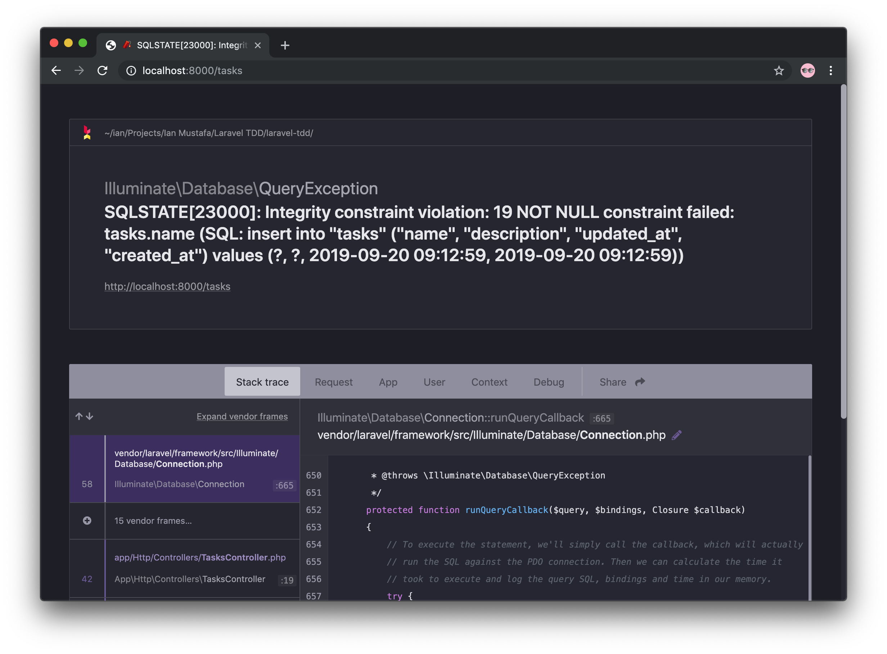
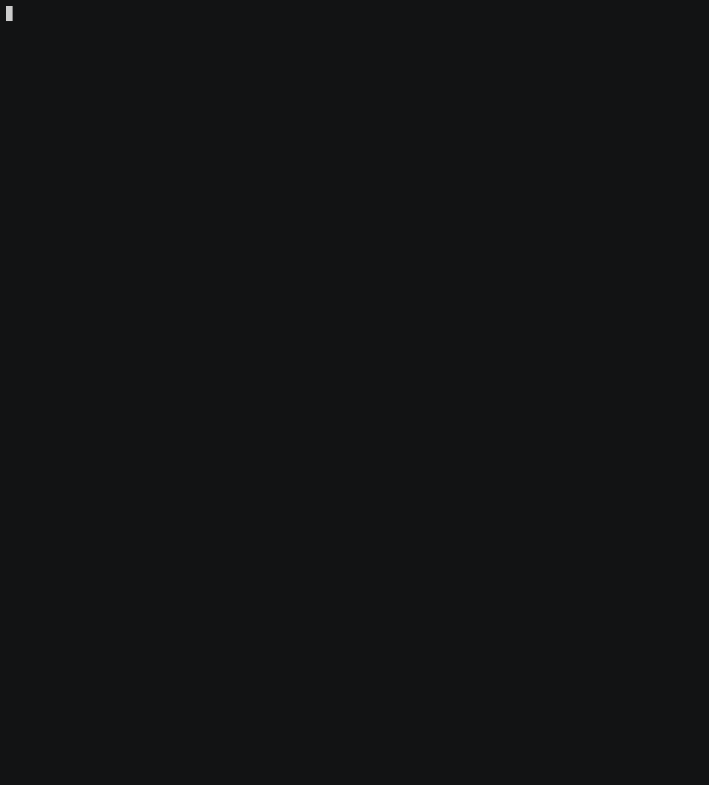
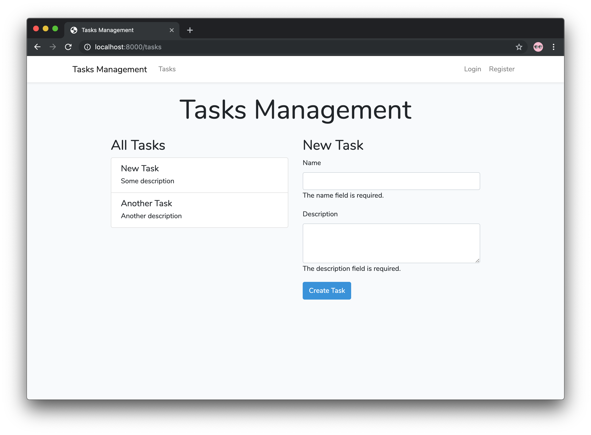
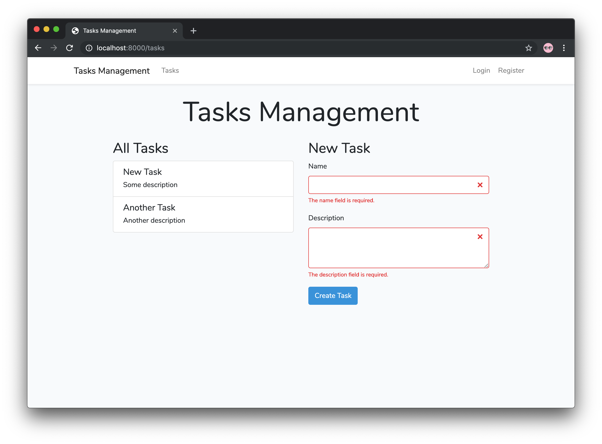
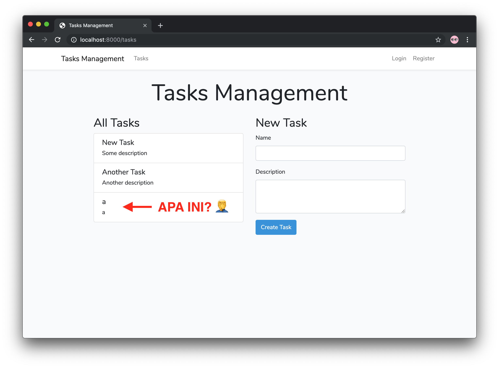
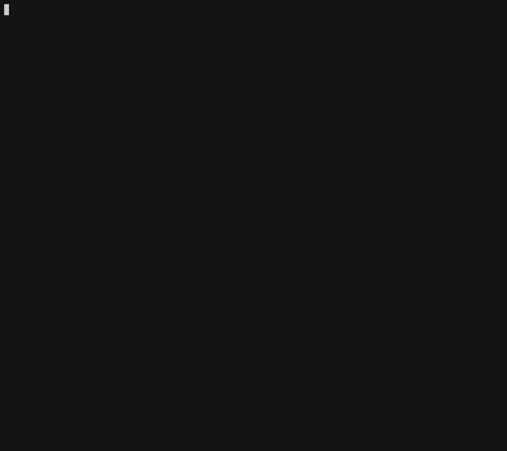
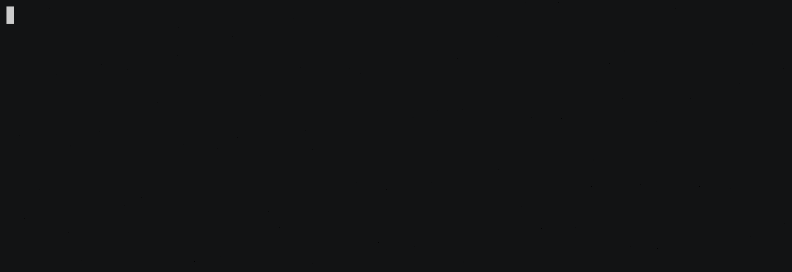
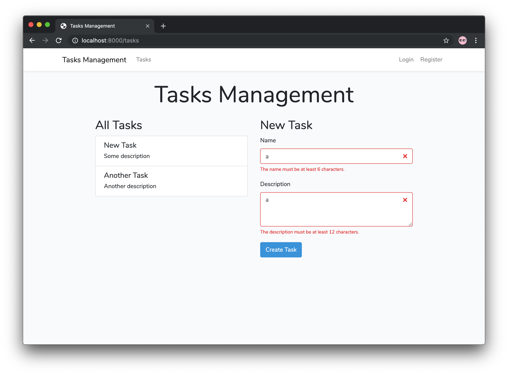
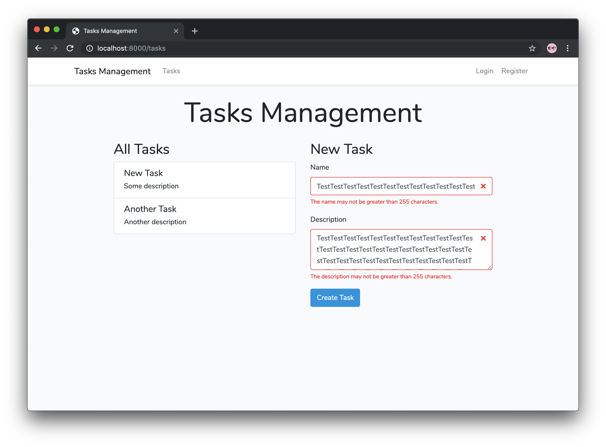

# Laravel 6.0 Test-Driven Development: Testing Form Validation

Kita sudah punya _form input_ untuk _task_. Tapi ada satu hal yang janggal: jika kita kosongkan salah satu dari _name_ maupun _description_ (atau keduanya), kita akan mendapat _error_ seperti berikut:


Ini disebabkan karena kolom `name` yang tidak diisi akan dianggap sebagai `null` oleh `Illuminate\Http\Request`, dan akan menyebabkan proses _insert_ ke _database_ dengan kolom `name` berisi `null`. Sedangkan pada _migration_ `xxxxxx_create_tasks_table.php`, kita tidak memberikan atribut `nullable()` pada kolom `name`, sehingga _database_ tidak akan mengijinkan kita untuk menyimpan data dengan kolom `name` bernilai `null`. Maka terjadilah `error` diatas.

Hal yang sama juga bisa terjadi pada kolom `description`, dengan alasan yang sama.

**Solusinya?** Kita harus membuat _form validation_ untuk memastikan kedua kolom `name` dan `description` diisi dengan benar. Tentu, kita perlu membuat pengujiannya dulu.

## Mari Kita Mulai
Seperti biasa, kita mulai dulu dengan menjalankan pengujian untuk memverifikasi kondisi _project_ sama prsis dengan terakhir kali.

### #1
#### Jalankan pengujian


#### Hasil: Passed
Hasilnya oke. Kita bisa lanjutkan dengan membuat _test method_ baru di `tests/Feature/ManageTaskTest.php` bernama `test_users_cannot_create_an_empty_task()`.

Untuk memberikan gambaran, seperti biasa kita bisa buat komentar yang menunjukkan tahapan pengujian:
```php
<?php
// tests/Feature/ManageTaskTest.php

class ManageTaskTest extends TestCase
{
    // ... function test_users_can_create_a_task()

    /** @test */
    public function test_users_cannot_create_an_empty_task()
    {
        // User membuka halaman "All Tasks"

        // User membiarkan kolom `name` dan `description` kosong, lalu klik "Create Task"

        // Pastikan kembali redirect ke halaman "All Tasks"

        // User dapat melihat pesan error dari validasi untuk kolom `name` dan `description`
    }

    // ...test_users_can_read_all_tasks()
}
```
Dari sini, pengujian bisa dibuat seperti ini:
```php
<?php
// tests/Feature/ManageTaskTest.php

class ManageTaskTest extends TestCase
{
    // ... function test_users_can_create_a_task()

    /** @test */
    public function test_users_cannot_create_an_empty_task()
    {
        // User membuka halaman "All Tasks"
        $this->visit('/tasks');

        // User membiarkan kolom `name` dan `description` kosong, lalu klik "Create Task"
        $this->submitForm('Create Task', [
            'name' => '',
            'description' => '',
        ]);

        // Pastikan kembali redirect ke halaman "All Tasks"
        $this->seePageIs('/tasks');

        // User dapat melihat pesan error dari validasi untuk kolom name dan description
        $this->see(__('validation.required', ['attribute' => 'name']));
        $this->see(__('validation.required', ['attribute' => 'description']));
    }

    // ...test_users_can_read_all_tasks()
}
```
Bisa dilihat di atas, kita menggunakan _helper_ `__()`. Helper ini digunakan mengambil pesan dari daftar teks sesuai bahasa di dalam direktori `resources/lang/`. Kita bisa manfaatkan _helper_ ini untuk mengambil pesan _error_ dari validasi yang ada di `resources/lang/en/validation.php`, untuk memastikan pesan validasi yang ditampilkan di halaman sudah sesuai dengan yang diharapkan. _Parameter_ kedua dari _helper_ `__()` digunakan untuk me-_replace_ nilai `:attribute` dalam pesan `error` sesuai dengan nama atribut atau kolom _input_ yang kita harapkan.

Jika teman-teman ingin mengetahui daftar lengkap pesan _error_ validasi dari Laravel, teman-teman bisa langsung buka `resources/lang/en/validation.php` untuk melihat daftar lengkapnya. Dari sana, teman-teman juga bisa menggunakan pesan validasi yang lain untuk pengujian yang berbeda.

Oke. Memanfaatkan _helper_ `__()`, kita ingin memastikan pesan _error_ `validation.required` untuk kolom `name` dan `description` dapat dilihat di halaman setelah _redirect_.

### #2
#### Jalankan pengujian


#### Hasil: Failed
```
A request to [http://localhost/tasks] failed. Received status code [500].

Caused by
PDOException: SQLSTATE[23000]: Integrity constraint violation: 19 NOT NULL constraint failed: tasks.name
```

#### Penyebab
Kita dapat pesan _error_ yang sama dengan _error_ yang tampil di _browser_ sebelumnya. Ini terjadi karena validasinya belum dibuat.

#### Solusi
Buat validasi di `TasksController@store`:
```php
<?php
// app/Http/Controllers/TasksController.php

class TasksController extends Controller
{
    // ... index()

    public function store(Request $request)
    {
        // Seperti biasa, jangan langsung dihapus
        // Task::create($request->only('name', 'description'));

        $payload = $request->validate([
            'name' => 'required',
            'description' => 'required',
        ]);

        Task::create($payload);

        return back();
    }
}
```

### #3
#### Jalankan pengujian


#### Hasil: Failed
```
Failed asserting that the page contains the HTML [The name field is required.]. Please check the content above.
```

#### Penyebab
Validasi sudah berjalan dan mencegah _form submit_ dengan data yang tidak sesuai, tapi pesan _error_ tidak ditemukan dalam halaman.

#### Solusi
Tampilkan pesan _error_ ke halaman. Kita bisa manfaatkan directive `@error` pada Blade untuk menampilkan pesan _error_ untuk kolom `name` dan `description`:
```html
<!-- .row -->
<div class="col-md-6 col-lg-5">
    <h2>New Task</h2>
    <form action="{{ url('tasks') }}" method="POST">
        @csrf
        <div class="form-group">
            <label for="name">Name</label>
            <input type="text" name="name" id="name" class="form-control" autocomplete="off">
            @error('name') {{ $message }} @enderror <!-- Tambahkan baris ini -->
        </div>
        <div class="form-group">
            <label for="description">Description</label>
            <textarea class="form-control" name="description" id="description" rows="3"></textarea>
            @error('description') {{ $message }} @enderror <!-- Tambahkan baris ini -->
        </div>
        <button type="submit" class="btn btn-primary">Create Task</button>
    </form>
</div>
<!-- /.row -->
```
Ingat, **lakukan usaha seminimal mungkin untuk mencapai _passed_**. Kita bisa perbaiki kode dan tampilan nanti setelah _passed_ dan masuk tahap refaktor.

### #4
#### Jalankan pengujian


#### Hasil: Passed
**Wah sudah _passed_! Cepet ya? 😂** Iya, karena di materi lalu, banyak sekali yang harus dikerjakan, mulai dari membuat _route_, _controller_, _model_, _migration_ dan _view_, sehingga sangat menyita waktu. Kali ini, kita hanya membuat _test method_, menambahkan validasi dan menampilkan pesan _error_ validasi saja.

Karena sudah passed, mari kita coba dari _browser_:


Oke sih, tapi masih kurang bagus 😁 Karena sebenarnya, jika mengikuti [panduan validasi dalam _form_ Bootstrap](https://getbootstrap.com/docs/4.3/components/forms/#validation), kita bisa memanfaatkan CSS _class_ `.is-invalid` untuk memberikan tanda pada kolom yang tidak lulus validasi,  dan membuat elemen dengan CSS _class_ `.invalid-feedback` untuk menampilkan pesan _error_ validasinya.

Jadi, kita bisa membuat perubahan seperti ini:
```html
<!-- .row -->
<div class="col-md-6 col-lg-5">
    <h2>New Task</h2>
    <form action="{{ url('tasks') }}" method="POST">
        @csrf
        <div class="form-group">
            <label for="name">Name</label>
            <input type="text" name="name" id="name" class="form-control @error('name') is-invalid @enderror" autocomplete="off">

            @error('name')
            <span class="invalid-feedback" role="alert">
                <strong>{{ $message }}</strong>
            </span>
            @enderror
        </div>
        <div class="form-group">
            <label for="description">Description</label>
            <textarea class="form-control @error('description') is-invalid @enderror" name="description" id="description" rows="3"></textarea>

            @error('description')
            <span class="invalid-feedback" role="alert">
                <strong>{{ $message }}</strong>
            </span>
            @enderror
        </div>
        <button type="submit" class="btn btn-primary">Create Task</button>
    </form>
</div>
<!-- /.row -->
```

Dengan perubahan seperti diatas, tampilan pesan _error_ validasi akan menjadi lebih baik:

**Tjakep 🎉**

## Tapi Tunggu! Ada Lagi!


Ternyata, _form_-nya bisa diisi hanya dengan satu karakter. Tentu saja, ini tidak dapat dibiarkan; mana ada nama atau deskripsi _task_ yang hanya berupa satu karakter?

Untuk itu, kita perlu menambahkan validasi tambahan. Artinya, kita juga perlu membuat _test method_ tambahan untuk melakukan pengujian terhadap proses validasi yang akan ditambahkan.

Kita mulai lagi dari menjalankan pengujian. _(yay...)_

### #5
#### Jalankan pengujian


#### Hasil: Passed
Masih _passed_. Oke, kita lanjutkan dengan membuat dua _test method_ baru:
* `test_users_cannot_create_a_short_task()` untuk memvalidasi input agar tidak terlalu pendek;
* `test_users_cannot_create_a_long_task()` untuk memvalidasi input agar tidak terlalu panjang;
Kita bisa buat sekaligus:
```php
<?php
// tests/Feature/ManageTaskTest.php

class ManageTaskTest extends TestCase
{
    // ... function test_users_cannot_create_an_empty_task()

    /** @test */
    public function test_users_cannot_create_a_short_task()
    {
        // User membuka halaman "All Tasks"
        $this->visit('/tasks');

        // User mengisi kolom `name` dan `description` dengan teks yang pendek, lalu klik "Create Task"
        $this->submitForm('Create Task', [
            'name' => 'Task',
            'description' => 'Desc',
        ]);

        // Pastikan kembali redirect ke halaman "All Tasks"
        $this->seePageIs('/tasks');

        // User dapat melihat pesan error dari validasi untuk kolom name dan description
        $this->see(__('validation.min.string', [
            'attribute' => 'name',
            'min' => 6
        ]));
        $this->see(__('validation.min.string', [
            'attribute' => 'description',
            'min' => 12
        ]));

        // User dapat melihat data yang ditolak masih ada di dalam input
        $this->seeInField('name', 'Task');
        $this->seeInField('description', 'Desc');
    }

    /** @test */
    public function test_users_cannot_create_a_long_task()
    {
        // User membuka halaman "All Tasks"
        $this->visit('/tasks');

        // User mengisi kolom `name` dan `description` dengan teks yang panjang, lalu klik "Create Task"
        $this->submitForm('Create Task', [
            'name' => str_repeat('Task', 75),
            'description' => str_repeat('Desc', 75),
        ]);

        // Pastikan kembali redirect ke halaman "All Tasks"
        $this->seePageIs('/tasks');

        // User dapat melihat pesan error dari validasi untuk kolom name dan description
        $this->see(__('validation.max.string', [
            'attribute' => 'name',
            'max' => 255
        ]));
        $this->see(__('validation.max.string', [
            'attribute' => 'description',
            'max' => 255
        ]));
        
        // User dapat melihat data yang ditolak masih ada di dalam input
        $this->seeInField('name', str_repeat('Task', 75));
        $this->seeInField('description', str_repeat('Desc', 75));
    }

    // ...test_users_can_read_all_tasks()
}
```

Kali ini, kita menggunakan pesan _error_ `validation.min.string` dan `validation.max.string` untuk untuk melakukan pengujian terhadap pesan _error_ yang dihasilkan oleh validasi. Bisa dilihat, kita menambahkan satu atribut tambahan (`min` untuk `validation.min.string` dan `max` untuk `validation.max.string`) ke dalam _parameter_ kedua dari _helper_ `__()` untuk menentukan panjang minimum dan maksimum yang diharapkan dari validasi.

Selain itu kita juga menambahkan _assertion_ untuk memastikan data yang ditolak masih ada di dalam kolom _input_; tentu akan menjengkelkan bagi _user_ jika data yang di-_input_ hilang setelah ditolak.

### #6
#### Jalankan pengujian


#### Hasil: Failed
```
1) Tests\Feature\ManageTaskTest::test_users_cannot_create_a_short_task
Failed asserting that the page contains the HTML [The name must be at least 6 characters.]. Please check the content above.

2) Tests\Feature\ManageTaskTest::test_users_cannot_create_a_long_task
Failed asserting that the page contains the HTML [The name may not be greater than 255 characters.]. Please check the content above.
```

#### Penyebab
Ada 2 _error_ yang dihasilkan disini, karena kita membuat 2 _test method_ yang sama-sama _fail_. Ini disebabkan oleh validasi untuk membatasi panjang _input_ belum ada.


#### Solusi
Tambahkan validasi `min` dan `max` untuk `name` dan `description` di `TasksController@store`:
```php
<?php
app/Http/Controllers/TasksController.php

class TasksController extends Controller
{
    // ... index()

    public function store(Request $request)
    {
        // Task::create($request->only('name', 'description'));

        $payload = $request->validate([
            'name' => 'required|min:6|max:255',
            'description' => 'required|min:12|max:255',
        ]);

        Task::create($payload);

        return back();
    }
}
```

### #7
#### Jalankan pengujian


#### Hasil: Failed
```
1) Tests\Feature\ManageTaskTest::test_users_cannot_create_a_short_task
Failed asserting that the field [name] contains the expected value [Task]. Please check the content above.

2) Tests\Feature\ManageTaskTest::test_users_cannot_create_a_long_task
Failed asserting that the field [name] contains the expected value [TaskTaskTaskTaskTaskTaskTaskTaskTaskTaskTaskTaskTaskTaskTaskTaskTaskTaskTaskTaskTaskTaskTaskTaskTaskTaskTaskTaskTaskTaskTaskTaskTaskTaskTaskTaskTaskTaskTaskTaskTaskTaskTaskTaskTaskTaskTaskTaskTaskTaskTaskTaskTaskTaskTaskTaskTaskTaskTaskTaskTaskTaskTaskTaskTaskTaskTaskTaskTaskTaskTaskTaskTaskTaskTask]. Please check the content above.
```

#### Penyebab
Lagi-lagi kedua _test method_ menghasilkan error, yang disebabkan karena kolom `name` tidak menampilkan data _input_ yang ditolak.

#### Solusi
Tambahkan `{{ old('name') }}` pada atribut `value` di _input text_ milik kolom `name`, dan `{{ old('description') }}` pada isi tag `textarea` milik kolom `description`:
```html
<input type="text" name="name" id="name" class="form-control @error('name') is-invalid @enderror" value="{{ old('name') }}" autocomplete="off">

<textarea class="form-control @error('description') is-invalid @enderror" name="description" id="description" rows="3">{{ old('description') }}</textarea>
```

### #8
#### Jalankan pengujian


#### Hasil: Passed
**Wehehe, _passed_.** Artinya, bisa kita coba lewat _browser_.




**Asyik, sudah bisa 🎉**