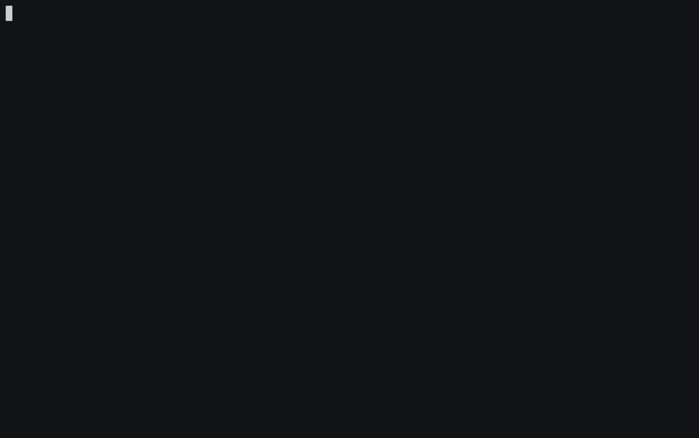
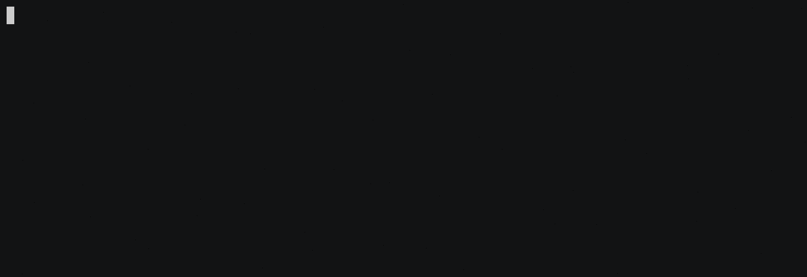

# Laravel 6.0 Test-Driven Development: Testing Tasks List With Model Factory

Saatnya mengerjakan pengujian selanjutnya: melihat daftar task. Sebenarnya, sub-fitur ini sudah selesai dibuat saat kita mengerjakan sub-fitur sebelumnya, tapi datanya datang dari pengisian _form_ "Add Task". Nah, untuk pengujian ini, kita akan menggunakan _model factory_ untuk meng-_generate_ beberapa task secara otomatis dari dalam pengujian.

_Model factory_ adalah fitur dari Laravel yang dapat digunakan untuk membuat _instance_ dari _model_ dengan atribut-atribut yang sesuai dengan kolom yang ada dari tabel _database_ milik _model_ bersangkutan.

#### Kenapa pakai _model factory_?
Supaya kita tidak terbebani dengan tugas mengisi atribut `name` dan `description` pada task; _model factory_ akan menggunakan bantuan [Faker](https://github.com/fzaninotto/faker) untuk mengisi atribut yang diperlukan. Nah, mengingat setiap kali kita memulai pengujian, _database_ berada dalam kondisi _fresh_ dan tidak berisi, _model factory_ bisa mempermudah proses pengisian data saat pengujian.

Di materi sebelumnya, kita sudah membuat _test method_ `test_users_can_read_all_tasks()` tapi isinya hanya berupa `$this->assertTrue(true)`:
```php
<?php
// tests/Feature/ManageTaskTest.php

class ManageTaskTest extends TestCase
{
    // ... test_users_cannot_create_a_long_task()

    /** @test */
    public function test_users_can_read_all_tasks()
    {
        $this->assertTrue(true);
    }

    // ... test_users_can_edit_an_existing_task()
}
```

Kita akan buat pengujian untuk _test method_ dengan memanfaatkan _model factory_. Kita juga akan sekalian menambahkan tombol edit untuk masing-masing Task, sehingga kita juga akan menguji keberadaan tombol edit ini. Fitur edit Task-nya sendiri akan kita kerjakan di materi selanjutnya.

## Mari Kita Mulai
Seperti biasa, kita mulai dulu dengan menjalankan pengujian untuk memverifikasi kondisi _project_ sama prsis dengan terakhir kali.

### #1
#### Jalankan pengujian


#### Hasil: Passed
Sip, masih sama. Artinya kita bisa mulai mengisi _test method_ `test_users_can_read_all_tasks()`. Seperti biasa, supaya mudah, kita buat komentar untuk menunjukkan tahapan pengujian:
```php
<?php
// tests/Feature/ManageTaskTest.php

class ManageTaskTest extends TestCase
{
    // ... test_users_cannot_create_a_long_task()

    /** @test */
    public function test_users_can_read_all_tasks()
    {
        // Buat 3 task untuk mengisi tabel `tasks`

        // User membuka halaman "All Tasks"

        // User bisa melihat ketiga task dalam halaman

        // User dapat melihat link untuk mengedit task pada masing-masing item task
    }

    // ... test_users_can_edit_an_existing_task()
}
```
Dari sini, pengujian bisa dibuat seperti ini. **Jangan lupa** untuk mengimpor model `App\Task`:
```php
<?php
// tests/Feature/ManageTaskTest.php

use App\Task; // Jangan lupa impor modelnya

class ManageTaskTest extends TestCase
{
    // ... test_users_cannot_create_a_long_task()

    /** @test */
    public function test_users_can_read_all_tasks()
    {
        // Buat 3 task untuk mengisi tabel `tasks`
        $tasks = factory(Task::class, 3)->create();

        // User membuka halaman "All Tasks"
        $this->visit('/tasks');

        // User bisa melihat ketiga task dalam halaman
        //== Task pertama
        $this->see($tasks[0]->name);
        $this->see($tasks[0]->description);
        //== Task kedua
        $this->see($tasks[1]->name);
        $this->see($tasks[1]->description);
        //== Task ketiga
        $this->see($tasks[2]->name);
        $this->see($tasks[2]->description);

        // User dapat melihat link untuk mengedit task pada masing-masing item task
        //== Task pertama
        $this->seeElement('a', [
            'id'   => "edit-task-{$tasks[0]->id}",
            'href' => url("tasks?action=edit&id={$tasks[0]->id}"),
        ]);
        //== Task kedua
        $this->seeElement('a', [
            'id'   => "edit-task-{$tasks[1]->id}",
            'href' => url("tasks?action=edit&id={$tasks[1]->id}"),
        ]);
        //== Task ketiga
        $this->seeElement('a', [
            'id'   => "edit-task-{$tasks[2]->id}",
            'href' => url("tasks?action=edit&id={$tasks[2]->id}"),
        ]);
    }

    // ... test_users_can_edit_an_existing_task()
}
```
Bisa dilihat di atas, kita menggunakan _helper_ `factory()` untuk menggunakan _model factory_, dengan menyertakan `class` dari _model_ `Task` sebagai _parameter_ pertamanya, agar _model factory_ tahu bahwa kita ingin membuat _instance_ dari _model_ `Task`. Sedangkan parameter kedua yang bersifat opsional digunakan untuk menentukan jumlah _instance_ dari _model_ yang akan dibuat. Jika parameter ini diisi, _model factory_ akan memberikan `return` berupa `Collection` dari _model_, bukan berupa _instance_ tunggal.

Setelah itu, kita panggil _method_ `create()` secara langsung agar 3 _instance_ `Task` yang sudah dibuat bisa disimpan ke _database_.

### #2
#### Jalankan Pengujian


#### Hasil: Failed
```
InvalidArgumentException: Unable to locate factory with name [default] [App\Task].
```

#### Penyebab
Belum ada _model factory_ untuk _model_ `Task`.

#### Solusi
Buat _model factory_ untuk _model_ `Task`:
```sh
$ php artisan make:factory TaskFactory --model=Task
```
Perintah di atas akan menghasilkan _model factory_ `TaskFactory` di `database/factory/TaskFactory.php`. Kita perlu menambahkan atribut `name` dan `description` untuk  _model factory_ ini, supaya Faker bisa tahu atribut mana yang harus diisi:
```php
<?php
// database/factory/TaskFactory.php

/** @var \Illuminate\Database\Eloquent\Factory $factory */

use App\Task;
use Faker\Generator as Faker;

$factory->define(Task::class, function (Faker $faker) {
    return [
        'name' => $faker->sentence(2), // Tambahkan baris ini
        'description' => $faker->sentence(6),  // Dan baris ini
    ];
});
```
_Method_ `sentence()` dari Faker berfungsi untuk membuat kalimat dengan jumlah kata tertentu. Kalimat yang dibuat menggunakan kata-kata dari Lorem Ipsum, jadi akan benar-benar acak. Namun tidak masalah, karena dalam pengujian, kita hanya akan memastikan supaya data yang ada di dalam _database_ bisa ditampilkan dengan benar.

### #3
#### Jalankan Pengujian


#### Hasil: Failed
```
Failed asserting that the page contains the element [a] with the attributes {"id":"edit-task-1","href":"http:\/\/localhost\/tasks?action=edit&id=1"}. Please check the content above.
```

#### Penyebab
Belum ada link untuk edit task.

#### Solusi
Buat link untuk edit task di _view_ `tasks.index`:
```html
<!-- @forelse ($tasks as $task) -->
<li class="list-group-item">
    <a href="{{ url('tasks?action=edit&id=' . $task->id) }}" id="edit-task-{{ $task->id }}" class="float-right">Edit</a> <!-- Tambahkan baris ini -->
    <h5 class="mb-1">{{ $task->name }}</h5>
    <p class="mb-0">{{ $task->description }}</p>
</li>
<!-- @empty -->
<!-- @endforelse -->
```

### #4
#### Jalankan Pengujian


#### Hasil: Passed
**Woke, selesai.** Saatnya kita buka dari _browser_:


**Link-nya sudah muncul dan sesuai 🎉** Plus, dengan penempatan di bagian atas dan ditambah dengan _utility class_ `.float-right` dari Bootstrap 4, posisinya langsung ada di kanan. 👍

#### Udah? Gitu aja pemakaian _model factory_?
_Well_, kita juga bisa memanfaatkan _model factory_ untuk mempermudah proses pembuatan task di _test method_ yang lain. **Tapi ini sifatnya opsional**; kita tidak harus menggunakan _model factory_ di semua _test case_, hanya yang diperlukan saja. Namun, tentu saja

Misalnya, kita bisa menggunakan _model factory_ di _test method_ `test_users_can_create_a_task()`. Jika dilihat, di dalam _test method_ ini, untuk mengisi kolom `name` dan `descripton`, kita masih menggunakan `array` yang ditulis secara manual:
```php
<?php
// tests/Feature/ManageTasksTest.php

class ManageTaskTest extends TestCase
{
    /** @test */
    public function test_users_can_create_a_task()
    {
        $this->visit('/tasks');

        // 1. Disini, data untuk pengisian kolomnya masih ditulis secara manual
        $this->submitForm('Create Task', [
            'name' => 'My First Task',
            'description' => 'This is my first task in my new job.',
        ]);

        // 2. Pengecekannya disini juga ditulis secara manual
        $this->seeInDatabase('tasks', [
            'name' => 'My First Task',
            'description' => 'This is my first task in my new job.',
            'is_done' => false,
        ]);

        $this->seePageIs('/tasks');

        // 3. Pengecekan disini juga masih manual
        $this->see('My First Task');
        $this->see('This is my first task in my new job.');
    }
}
```
Kita bisa memanfaatkan _model factory_ supaya kita tidak perlu lagi repot-repot mengarang teks untuk task-nya seperti contoh di atas. _One less thing to worry about._

Yang berbeda, jika di contoh sebelumnya kita menggunakan _method_ `create()` setelah memanggil _model factory_ agar _instance_ `Task`-nya disimpan langsung ke _database_, kita akan menggunakan _method_ `make()` supaya _instance_ `Task`-nya hanya di-`return` saja:
```php
<?php
// tests/Feature/ManageTasksTest.php

class ManageTaskTest extends TestCase
{
    /** @test */
    public function test_users_can_create_a_task()
    {
        // Panggil TaskFactory di bagian atas test method
        $task = factory(Task::class)->make(); 

        // $this->visit()...
    }
}
```
_Variable_ `$task` selanjutnya bisa digunakan layaknya _instance model_ pada umumnya: kita bisa ambil atribut _model_ dari situ, atau diubah menjadi `array` dengan _method_ `toArray()`. Mari kita gunakan untuk menggantikan kode di bagian `$this->submitForm()`:
```php
<?php
// tests/Feature/ManageTasksTest.php

class ManageTaskTest extends TestCase
{
    /** @test */
    public function test_users_can_create_a_task()
    {
        // $this->visit()...

        // Kita bisa ubah deklarasinya menjadi seperti ini
        $this->submitForm('Create Task', $task->toArray());

        // $this->seeInDatabase()...
    }
}
```
Lanjut ke bagian `$this->seeInDatabase()`. Kita bisa langsung buat sama seperti di bagian `$this->submitForm()`. Hanya saja, di kode sebelumnya, kita juga memastikan kolom `is_done` bernilai `false`. Sedangkan di _model factory_ untuk `Task`, kita tidak menambahkan atribut `is_done`.

Solusinya, kita bisa tambahkan atributnya dulu menggunakan _method_ `setAttribute()` yang tersedia dalam semua _instance_ `Eloquent\Model`, sebelum memanggil _method_ `toArray()` lagi. Jadinya seperti ini:
```php
<?php
// tests/Feature/ManageTasksTest.php

class ManageTaskTest extends TestCase
{
    /** @test */
    public function test_users_can_create_a_task()
    {
        // $this->submitForm()...

        // Kita tambahkan atribut `is_done` dulu
        $task->setAttribute('is_done', false);
        // Lalu ubah deklarasinya menjadi seperti ini
        $this->seeInDatabase('tasks', $task->toArray());

        // $this->seePageIs()...
    }
}
```
Hanya menyisakan bagian terakhir: dua deklarasi `$this->see()` di akhir _test method_. Kita bisa panggil atribut dari `$task` seperti biasa:
```php
<?php
// tests/Feature/ManageTasksTest.php

class ManageTaskTest extends TestCase
{
    /** @test */
    public function test_users_can_create_a_task()
    {
        // $this->seePageIs()...

        // Ubah menjadi seperti ini
        $this->see($task->name);
        $this->see($task->description);
    }
}
```
Selesai. Kita bisa jalankan pengujian untuk memastikan tidak ada yang rusak.

### #5


#### Hasil: Passed
**Sip. 👍**

#### Nah, untuk _test method_ lain, bisa dibikin seperti ini?
**Bisa.** Namun, untuk _test method_ yang menuntut isi task yang berbeda dengan normal &mdash;seperti _test method_ untuk validasi yang mengharuskan kita membuat task dengan atribut yang "tidak umum"&mdash; kita perlu _factory_ yang dapat menghasilkan _instance_ `Task` dengan atribut yang sesuai dengan kebutuhan diatas.

Untuk itu, kita bisa memanfaatkan fitur _[factory states](https://laravel.com/docs/master/database-testing#factory-states)_ dari _model factory_. _Factory states_ dapat digunakan untuk membuat berbagai "versi" _factory_ yang bisa memberikan hasil return yang berbeda. Mari kita buat 3 _factory states_ untuk `TaskFactory` sesuai kebutuhan diatas:
```php
<?php
// database/factory/TaskFactory.php

// $factory->define()...

$factory->state(Task::class, 'empty', [
    'name' => '',
    'description' => '',
]);

$factory->state(Task::class, 'short', function (Faker $faker) {
    return [
        'name' => $faker->randomLetter,
        'description' => $faker->randomLetter,
    ];
});

$factory->state(Task::class, 'long', function (Faker $faker) {
    return [
        'name' => $faker->sentence(75, false),
        'description' => $faker->sentence(75, false),
    ];
});
```
Sesuai namanya, masing-masing _state_ menentukan atribut yang akan dipakai dalam _factory_:
* State `empty` menggunakan `string` kosong dalam deklarasi atributnya. Perhatikan juga disini kita tidak menggunakan `Closure` untuk mendeklarasikan atribut, tapi menggunakan `array`. Ini karena kita tidak perlu memanggil Faker di dalam deklasasinya, jadi kita bisa pakai `array` langsung;
* State `short` menggunakan `$faker->randomLetter` dalam deklarasi atributnya. _Property_ ini akan menghasilkan satu karakter alfabet acak, sangat tepat untuk digunakan dalam pengujian validasi karakter minimum;
* State `long` menggunakan `$faker->sentence()` dalam deklarasi atributnya. _Method_ sudah kita gunakan dalam deklarasi _factory_ sebelumnya. Bedanya, kita tambahkan _parameter_ kedua dengan nilai `false` untuk memastikan kalimat yang dihasilkan oleh Faker tepat sejumlah 75 kata;

Lalu, dalam masing-masing _test method_ yang terkait, kita bisa gunakan _factory state_ dengan menambahkan _method_ `state()` sebelum memanggil _method_ `make()`, dengan `paramater` berupa nama _state_ yang ingin digunakan. Sisanya sama seperti di atas: ganti bagian `$this->submitForm()`, `$this->see()` dan `$this->seeInField()`:
```php
<?php
// tests/Feature/ManageTasksTest.php

class ManageTaskTest extends TestCase
{
    // ... function test_users_can_create_a_task()

    /** @test */
    public function test_users_cannot_create_an_empty_task()
    {
        // Panggil TaskFactory dengan state 'empty'
        $task = factory(Task::class)->state('empty')->make();

        // $this->visit() ...

        // Ubah deklarasinya
        $this->submitForm('Create Task', $task->toArray());

        // $this->seePageIs(), $this->see() ...
    }

    /** @test */
    public function test_users_cannot_create_a_short_task()
    {
        // Panggil TaskFactory dengan state 'short'
        $task = factory(Task::class)->state('short')->make();

        // $this->visit() ...

        // Ubah deklarasinya
        $this->submitForm('Create Task', $task->toArray());

        // $this->seePageIs(), $this->see() ...

        // Ubah juga deklarasinya
        $this->seeInField('name', $task->name);
        $this->seeInField('description', $task->description);
    }

    /** @test */
    public function test_users_cannot_create_a_long_task()
    {
        // Panggil TaskFactory dengan state 'long'
        $task = factory(Task::class)->state('long')->make();

        // $this->visit() ...

        // Ubah deklarasinya
        $this->submitForm('Create Task', $task->toArray());

        // $this->seePageIs(), $this->see() ...

        // Ubah juga deklarasinya
        $this->seeInField('name', $task->name);
        $this->seeInField('description', $task->description);
    }
}
```

### #5


#### Hasil: Passed
**Mantap 🤩**